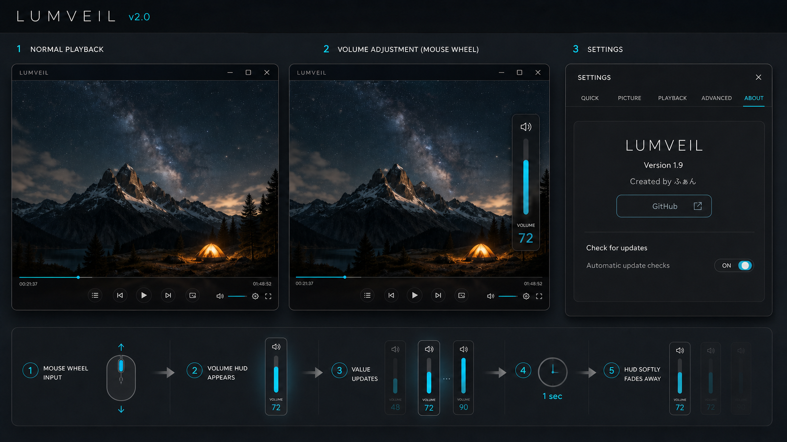

# Lumveil v2.0 改善提案

作成日: 2026-08-02  
状態: 承認済み・実装および実機検証完了

## 目的

動画を主役にしたまま、操作時だけ必要な情報が滑らかに現れ、設定は初見でも見つけやすいLumveilを目指す。

## 1. 音量HUD（一時表示）

### 提案仕様

- 動画キャンバス上でマウスセンターホイールを回して音量を変更している間、音量HUDを自動表示する。
- HUDは動画の右端寄りに置く縦型ボリュームバーとし、動画の主対象を隠さない。
- 現在音量、スピーカー状態、バーの位置を同時に視覚化する。
- ホイール入力のたびに音量値とバーを更新し、次の入力が来たら非表示タイマーをリセットする。
- 最後のホイール入力から1秒後に、レイアウトを動かさずフェードアウトして閉じる。
- 音量は0〜100にクランプし、ミュート解除、フルスクリーン、設定ウィンドウ表示中の入力競合を既存仕様に合わせる。

### 実装時の受け入れ条件

1. 動画上でホイールを1ノッチ回すとHUDが表示され、値が1回分だけ変わる。
2. 連続入力中はHUDが消えず、最後の入力から約1秒後にだけ消える。
3. HUDの表示・非表示で動画領域や操作バーのレイアウトが跳ねない。
4. 0および100で値が範囲外へ進まず、既存の保存音量と一致する。
5. 設定画面や既存の音量ポップアップ上では、音量変更とスクロールが二重に発火しない。

## 2. GUI全体の見直し

### デザイン方針

- 動画面を最大面積にし、常時表示UIは細く静かなものにする。
- 再生コントロールは半透明・低コントラストを基本にし、ホバーや操作時だけ視認性を上げる。
- 操作ボタンは再生、シーク、音量などの主要操作を優先し、補助機能は「その他」へ整理する。
- 再生ボタンは目立たせすぎず、隣接する戻る・進む・停止などの操作ボタンと同じ大きさに揃える。
- 設定は「かんたん」「画質」「再生」「詳細」の階層を維持しつつ、カードと短い説明で読みやすくする。
- 現在の暗色・シアンアクセント・AUTO補正の状態表示はLumveilの個性として継承する。

### 今回の判断範囲

- 図のレイアウト、音量HUDの位置・大きさ・透明度、設定画面の情報密度を確認する。
- GUI全体の刷新を一括で実装するか、音量HUDを先行して小さく実装するかを決める。
- 動画再生、AUTO補正、GPU/シェーダー、再生リストなどの既存機能は、見た目の変更で壊さないことを前提にする。

### Aboutタブ

設定画面に「About」タブを追加し、以下を表示する。

- アプリ名: Lumveil
- バージョン: `2.0.0`
- 作者名: ふぁん
- GitHub: `https://github.com/dhinsk65-create/Lumveil`
- 更新確認: 「今すぐ確認」と自動アップデート確認のON/OFF

## 3. GitHub Release更新

### 提案仕様

- GitHub Releaseに新しいバージョンがある場合、アプリ内に通知カードまたは非モーダル通知を表示する。
- 通知には新バージョン、リリースノートへのリンク、ダウンロード、インストールの操作を表示する。
- 「今すぐ確認」は自動アップデート確認がOFFでも利用できるようにする。
- 自動アップデート確認がONの場合は、起動時に毎回通信せず、前回確認から一定時間が経過したときだけバックグラウンドで確認する。
- ダウンロードとインストールは、ユーザーが明示的に確認した後に開始する。再生中の動画を中断しない。
- インストール処理はアプリ終了後に安全に適用し、失敗時は現在のバージョンを維持する。
- GitHubへ接続できない場合は再生機能を止めず、設定画面のステータス欄へ理由を表示する。

### 初期値と判断ポイント

- 初期値は「自動アップデート確認 OFF」を候補とする。意図しない通信や更新を避けられるため。
- 自動確認をONにしても、サイレントインストールは行わず、通知・確認を経由する。
- Windows配布物がZIPかインストーラーかで更新方式が変わるため、実装時にGitHub Releaseの現在の配布形式を確認する。

## 4. ライセンス表示と配布形態の確認

### Aboutに必要な表示

Aboutタブには、アプリ情報だけでなく、短いライセンス概要と「第三者ライセンス一覧」への導線を置く。全文を通常画面に詰め込まず、インストール先またはAboutから開ける `THIRD_PARTY_NOTICES.md` と各ライセンス本文を同梱する。

最低限、次を表示・同梱する。

- Lumveilの著作権者: ふぁん
- FFmpegのライセンスと対応するソースコード情報
- mpv/libmpvの実際のビルドモードに対応するライセンス
- Anime4K: MIT License
- Pillow: MIT-CMU License
- tkinterdnd2: MIT License
- Python: Python Software Foundation License
- PyInstaller: バンドル成果物は任意のライセンスで配布できる例外を確認済み。ただし依存コンポーネントの条件は別途満たす。

### 現行ファイルの監査結果

- 同梱 `ffmpeg.exe` は、実行結果が `--enable-gpl --enable-version3`、`ffmpeg -L` がGPLv3を示すGyan.devのfull buildである。READMEの `FFmpeg: LGPLv2.1+` は修正が必要。
- `lumveil.py` はFFmpegを `subprocess.run()` で別プロセスとして起動しているため、FFmpeg部分のライセンス条件を満たせば、FFmpegだけでLumveil本体全体が自動的にGPLになると断定する状況ではない。ただし、別プロセスでも配布時のGPL通知・ソース情報は必要。
- `libmpv-2.dll` はアプリプロセスへ直接ロードしている。ファイル情報は `v0.41.0-744-g304426c39` だが、GPLビルドかLGPLビルドかを示すビルド設定は現物から確定できていない。mpvの公式説明では、標準はGPLv2+、`-Dgpl=false` でLGPLv2.1+になるため、現行DLLを「LGPL」と表記してReleaseするのは未確認のままでは不可。
- 現在のリポジトリには、同梱バイナリのライセンス本文・対応ソース情報をまとめた通知ファイルがない。

### インストーラー化の判断

`C:\Program Files\Lumveil` を既定のインストール先にすること自体に、ライセンス上の支障はない。Windowsの保護フォルダなので、インストーラーと更新適用には管理者権限が必要になる。設定・履歴・スクリーンショットは既存どおり `%APPDATA%\Lumveil\` に保存し、アプリ本体の書き込みとは分離する。

更新機能は、ダウンロードをユーザー領域または一時領域で行い、Lumveil終了後に昇格済みの更新ヘルパーまたはインストーラーで `Program Files` 側へ適用する。ライセンス同意を理由に無条件のサイレント更新を行わず、Aboutまたは更新通知でユーザー確認を挟む。

### Release前の必須対応

1. `libmpv-2.dll` の入手元・ビルド設定・ライセンスを確定し、必要ならLGPLモードで再ビルドする。
2. GPLv3版FFmpegを使い続ける場合は、`COPYING.GPLv3`、正確なビルド設定、対応ソースコードの取得先を配布物とReleaseへ追加する。
3. READMEの誤ったFFmpeg/mpvライセンス表記を修正する。
4. `THIRD_PARTY_NOTICES.md` と `licenses\` を作り、ZIP・インストーラー・インストール先のすべてで参照できるようにする。
5. GitHub Releaseの現行公開版とローカルの実装版を整理してから、更新確認機能を接続する。

## 実装前の注意

現行実装には、音量ボタンから開く縦型ポップアップ、`vol_var`、`_on_volume_wheel`、動画キャンバス上の共通ホイール処理がすでにある。v2.0ではこれらを活用し、音量HUDを別ウィンドウとして常駐させるのではなく、動画上の一時オーバーレイとして追加するのが低リスク。

Aboutタブのアプリ情報は、READMEの現行情報（ver.2.0.0、制作: ふぁん、GitHubリポジトリ）と一致させた。Release更新機能は、ネットワーク処理、バージョン比較、SHA-256検証、インストーラ起動を分離して実装した。

## 実装・検証結果

- 動画中心のUIを抜本刷新。アプリ内ブランドヘッダーを撤去し、動画キャンバスをクライアント領域いっぱいに配置。操作ドックは通常時にv1.8型の下部固定、全画面時のみマウス下端ホバーで一時表示する。
- 再生ボタンは他の再生操作ボタンと同じ大きさ・同じ基調色へ統一し、頻用項目だけを常時表示、補助項目を「…」へ集約する新レイアウトへ移行した。
- 設定画面は標準ttkタブを隠し、QUICK / PICTURE / PLAYBACK / ADVANCED / ABOUTのカスタムタブバーへ変更した。設定項目は既存の高度な機能を維持したままカード面で整理した。
- 音量HUDは廃止し、従来の縦型ボリュームバーをマウスホイール操作でも表示するよう変更した。Aboutタブ、自動更新確認ON/OFF、GitHub Release確認、SHA-256検証後のダウンロード・インストーラ起動も実装した。
- シークバーはポインターが触れた瞬間にプレビュー枠を表示し、ポインターが外れたときはバックグラウンド生成結果を含めて確実に消去するよう改善した。
- `mpv-dev-lgpl-x86_64-20260801-git-1d15686142`の`libmpv-2.dll`へ差し替え、アーカイブとDLLのSHA-256を記録した。
- `THIRD_PARTY_NOTICES.md`と`licenses\`を作成し、インストーラとインストール先へ同梱した。
- NSISインストーラを作成し、`C:\Program Files\Lumveil`への実インストールと起動を確認した。
